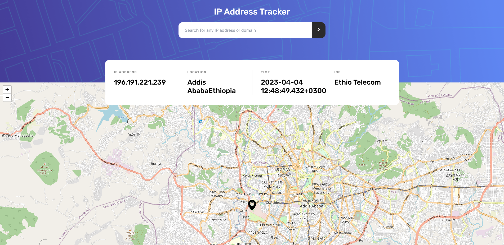

# IP address tracker solution - Frontend Mentor

This is a solution to the [IP address tracker challenge on Frontend Mentor](https://www.frontendmentor.io/challenges/ip-address-tracker-I8-0yYAH0). Frontend Mentor challenges help you improve your coding skills by building realistic projects.

## Table of contents

- [Overview](#overview)
  - [The challenge](#the-challenge)
  - [Screenshot](#screenshot)
  - [Links](#links)
- [My process](#my-process)
  - [Built with](#built-with)
  - [What I learned](#what-i-learned)
- [Author](#author)
- [Acknowledgments](#acknowledgments)

## Overview

### The challenge

Users should be able to:

- View the optimal layout for each page depending on their device's screen size
- See hover states for all interactive elements on the page
- See their own IP address on the map on the initial page load
- Search for any IP addresses or domains and see the key information and location

### Screenshot

### Links

- Solution URL: [Click here](https://github.com/betses/ip-address-tracker-master)
- Live Site URL: [Click here](https://your-live-site-url.com)

## My process

### Built with

- [Tailwind CSS](https://tailwindcss.com/)
- [React](https://reactjs.org/)
- [API](https://ipgeolocation.io/documentation.html)
- [Leaflet.js](https://leafletjs.com/) - JS library

### What I learned

I learned a lot while building this app. I learned how to interact with remote API servers and how to populate the UI with incoming responses from servers. I have used a different API for tracking IP's than what was recommended by Frontend mentors. The API I used allows upto 10000 calls a month as opposed to only 1000 calls on the recommended one. Of course, I'm not sutisfied by this change for the API i used is less accurate when revealing locations.

## 👥 Author 

> 👤 **Betsegaw Sebsibe**

- GitHub: [@betses](https://github.com/betses)
- Frontend Mentor - [@betses](https://www.frontendmentor.io/profile/betses)
- LinkedIn: [Betsegaw Sebsibe](https://www.linkedin.com/in/betsegaw-sebsibe/)
- Twitter: [@betse_s](https://twitter.com/Betse_s)

## Acknowledgments

- Frontend Mentor for giving me the opportunity
